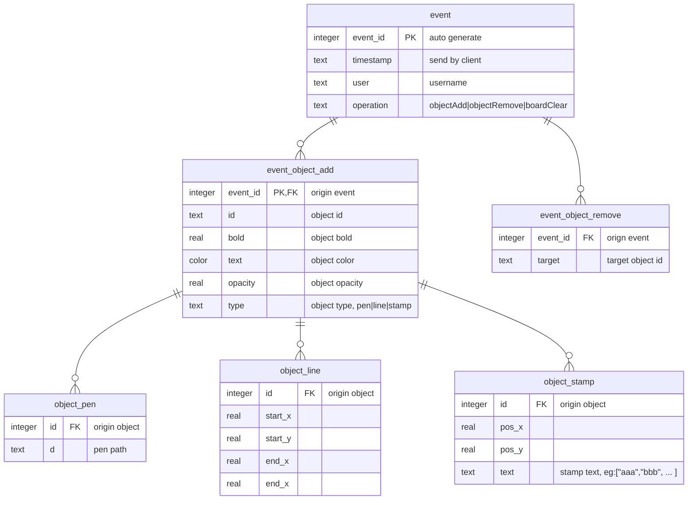

# paint
Golangで自分のために作成  
開発環境:rpi4(8gb) golang(go1.17.8 linux/arm64)  

## -起動-  
```go run main.go```
  
## アクセス  
`http://<localIP>/?room=<roomID>`
## コード元:  
Bot Language   : https://golang.org/  


- Top:
  - Input:
    - Name: string(user name)
    - Room: string(room name)
  - Button:
    - Submit: jump to Room
- Room:
  - Button:
    - Select Pen
    - Color Selector
    - Undo
    - Redo
    - Clear All
    - Copy Link
    - Text
    - Box
    - Line
    - Circle
  - Other:
    - Zoom in
    - Zoom out
    - Move


rooms.db ER mappings
